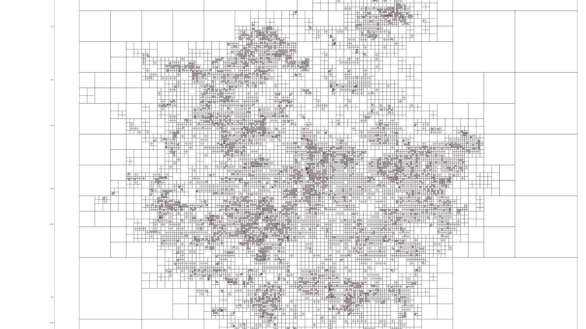
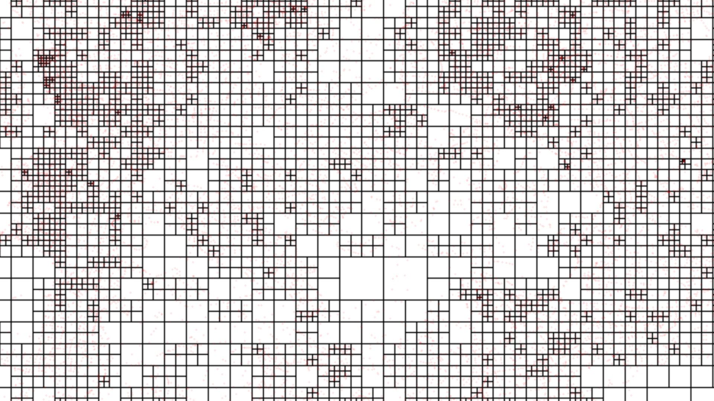

# Quickest path in London

## About
Extracting infomations of road networking in London from [openstreetmap](https://www.openstreetmap.org/), this can then run Dijsktra Algorithm to find shortest path. Using OpenAPI to implement server and Google Map API to get nice background map from Google. Slight tweak with heuristic approach: assuming one's velocity is road's max-speed, quickest route is obtained.

## Run command
```
cd ./Sources/Shortest_Path
uvicorn main:app --reload
```

## Road color

| Road                       | Color | |
|----------------------------|:----------------:|--------:|
| `motorway`                 | `crimson      `| |
| `trunk`                    | `coral        `|             | 
| `primary`                  | `gold         `|           | 
| `secondary`                | `limegreen    `|   |
| `tertiary`                 | `cyan         `| | 
| `residential`              | `deepskyblue  `|           | 
| `living_street`            | `mediumblue   `|           | 
| `pedestrian`               | `blueviolet   `|     | 
| `unclassified`             | `fuchsia      `|    | 

## Demo video


## Technical
* Stats:
    * Nodes: ~560k
    * Named node: ~40k
    * `connection.json`: ~350mb
* Shortest Path:
  * Function sh(src, des, by):
      * `src` : source (node_id)(str)
      * `des` : destination (node_id)(str)
      * `by` : `time` or `distance` (str)
  * Class QTree:
      * `__init__(k, data_list)`:
          * `k`: threshold for number of point in smallest cell
          * `data_list`: `list(data.items())`
      * `add_point(point)`
      * `recursive_subdivide(node, k)`
      * `contains(x, y, w, h, points)`: Check if reactangle top left corner `(x, y)` size `(w, h)` contains all points
      * `find_children(node)`
      * `graph()`: Draw plt grap to `quadtree.png`
  * Class editDistance:
      * `compute_edit_dist(s1, s2)`: return edit distance of s1 and s2
      * `nearest_name_get(search)`: get nearest name compare to `search`
  * Class KdTree:
      * `__init__(data)`: 
          * `data`: from `connection.json`
      * `make_kd_tree(points)`: 
          * `points`: list of all points
      * `add_point(point)`
      * `get_nearest(point)`
* Features:
    * Find by Name: Input 2 name, 
## Performance:
* Start-up Time:
    * Read `connection.json`: ~8s 
    * KdTree: ~4s
    * editDistance: ~0.5s
    * Qtree: ~20s (Use only once to produce `quadtree.png`)
    * Other: ~1s
    * Total: ~13.5s (non Qtree) && ~34s (Qtree)
* API Time:
    * Find By Name: ~2s (get places from name) + ~1s (quickest path)
    * Find By Pos: ~1s (get nearest valid pos from marker) + ~1s (quickest path)
## Team members: 
  * Cao Ngoc Hieu
  * Nguyen Gia Huy
  * Nguyen Tai Loc

## Quad tree



